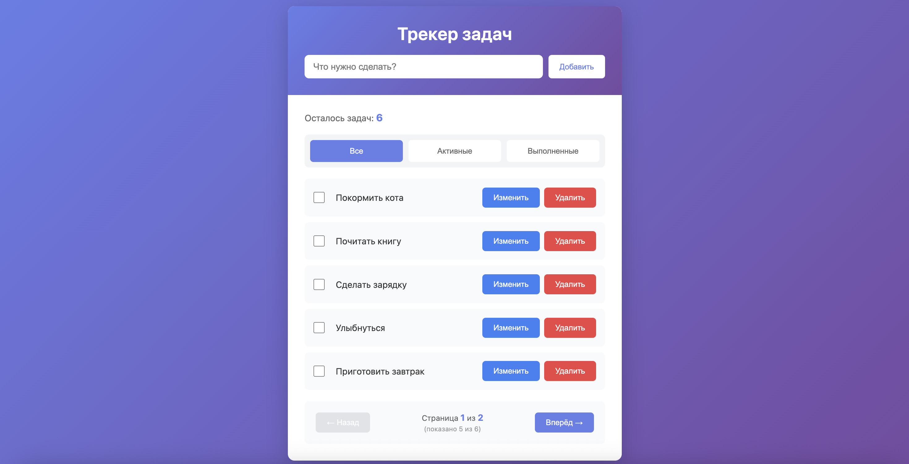

# 📝 Трекер задач (Todo List)

Простое и элегантное приложение для управления задачами на Vue 3 + Vite с хранением данных в браузере.


## 🌐 Демо

**[👉 Открыть приложение](https://todolist-nine-gamma-98.vercel.app/)**

Живая демо-версия развёрнута на Vercel. Попробуйте прямо сейчас — работает полностью в браузере без бэкенда!

<div align="center">



</div>

---

## 🎯 О проекте

**Todo List** — это минималистичный трекер задач, созданный для демонстрации возможностей современной веб-разработки. Приложение работает полностью в браузере, не требует бэкенда и сохраняет все данные локально.

**Создано с любовью в [Cursor](https://cursor.sh)** ❤️ — AI-редакторе нового поколения.

---

## ✨ Функциональность

- ✅ **Управление задачами** — добавление, редактирование, удаление
- 🖱️ **Быстрое редактирование** — кликните на задачу для изменения
- ☑️ **Отметка выполнения** — чекбоксы для отслеживания прогресса
- 🔍 **Фильтрация** — просмотр всех/активных/выполненных задач
- 📄 **Пагинация** — автоматическая разбивка списка (5 задач на страницу)
- 💾 **Автосохранение** — данные сохраняются в localStorage автоматически
- ⌨️ **Горячие клавиши** — Enter для сохранения, Esc для отмены
- 📊 **Статистика** — счётчик активных и выполненных задач
- 📱 **Адаптивный дизайн** — работает на десктопе и мобильных устройствах
- ♿ **Доступность** — ARIA-атрибуты и поддержка клавиатурной навигации

---

## 🚀 Быстрый старт

### Установка

```bash
# Клонируйте репозиторий
git clone https://github.com/ваш-username/todolist.git
cd todolist

# Установите зависимости
npm install
```

### Запуск

```bash
# Режим разработки
npm run dev

# Сборка для продакшена
npm run build

# Просмотр продакшен-сборки
npm run preview

# Запуск тестов
npm run test
```

Приложение откроется по адресу `http://localhost:5173`

---

## 🛠️ Технологии

- **[Vue 3](https://vuejs.org/)** — прогрессивный JavaScript-фреймворк
- **[Vite](https://vitejs.dev/)** — быстрый инструмент сборки
- **[Vitest](https://vitest.dev/)** — фреймворк для тестирования
- **Composition API** — современный подход к написанию Vue компонентов
- **localStorage** — хранение данных без сервера

---

## 📁 Структура проекта

```
todolist/
├── src/
│   ├── components/          # Vue компоненты
│   │   ├── TodoInput.vue    # Форма добавления задачи
│   │   ├── TodoList.vue     # Список с фильтрами и пагинацией
│   │   └── TodoItem.vue     # Отдельная задача
│   ├── composables/         # Переиспользуемая логика
│   │   └── useTodos.js      # Управление состоянием задач
│   ├── App.vue              # Корневой компонент
│   ├── main.js              # Точка входа
│   └── styles.css           # Глобальные стили
├── tests/                   # Юнит-тесты
│   └── useTodos.test.js
├── index.html
├── vite.config.js
└── package.json
```

---

## 💡 Особенности реализации

### Composable Pattern

Вся бизнес-логика вынесена в `useTodos.js` — переиспользуемую композицию, которая управляет состоянием приложения:

```javascript
const {
  todos,              // реактивный массив задач
  filteredTodos,      // отфильтрованный список
  remainingCount,     // счётчик активных задач
  addTodo,            // добавить задачу
  toggleTodo,         // переключить статус
  updateTitle,        // обновить название
  removeTodo,         // удалить задачу
  setFilter           // установить фильтр
} = useTodos()
```

### Автоматическая персистентность

Используется Vue `watch` для автоматического сохранения изменений:

```javascript
watch(todos, (newTodos) => {
  localStorage.setItem('todos-v1', JSON.stringify(newTodos))
}, { deep: true })
```

### Умная пагинация

Пагинация включается автоматически при наличии более 5 задач и сбрасывается при смене фильтра.

---

## 🧪 Тестирование

Проект покрыт юнит-тестами с использованием Vitest:

- ✅ CRUD операции с задачами
- ✅ Фильтрация и подсчёт
- ✅ Валидация данных
- ✅ Работа с localStorage
- ✅ Генерация уникальных ID

```bash
npm run test
```

---

## 🎨 Дизайн

- 🌈 Градиентный фиолетовый фон
- ✨ Плавные анимации и transitions
- 🎯 Hover-эффекты для интерактивных элементов
- 📐 Чистый CSS без UI-фреймворков
- 🌗 Современная типографика

---

## 📦 Сборка

Проект использует Vite для быстрой сборки и оптимизации:

```bash
npm run build
```

Результат сборки попадает в папку `dist/` и готов к деплою на любой статический хостинг (Vercel, Netlify, GitHub Pages).

---

## 🤝 Вклад в проект

Буду рад вашим предложениям и улучшениям! Создавайте Issues и Pull Requests.

---

## 📄 Лицензия

MIT © 2025

---

## 🙏 Благодарности

Проект создан с использованием [Cursor](https://cursor.sh) — AI-редактора, который делает разработку быстрой и приятной.

---

**⭐ Если проект оказался полезным — поставьте звезду!**
